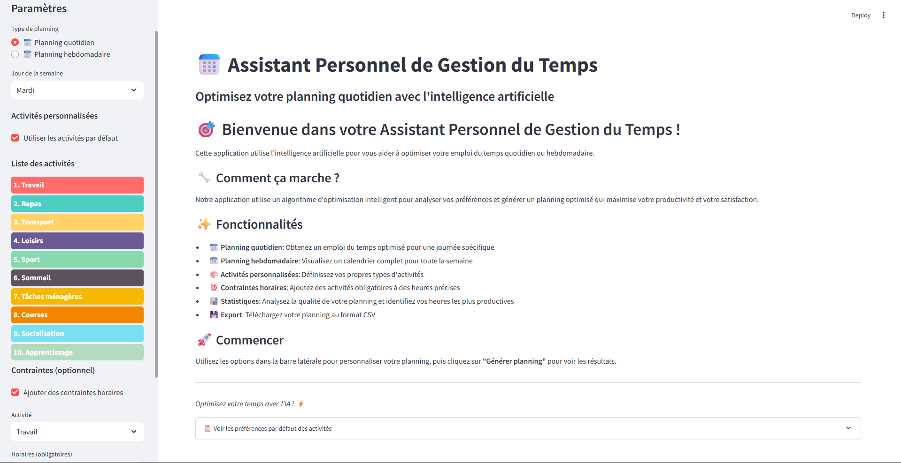
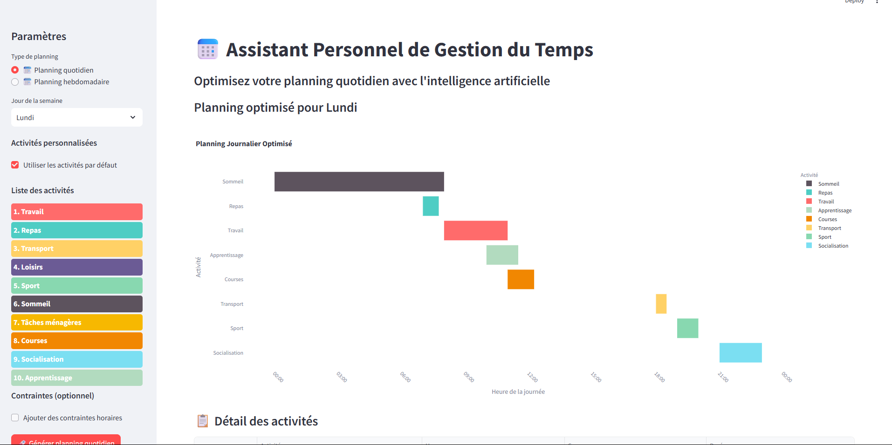
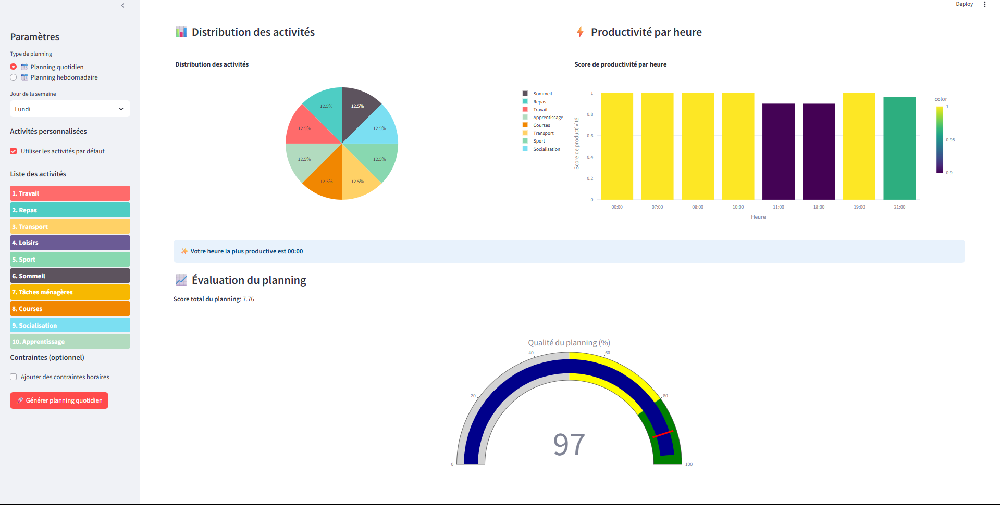

# Optimisation de plannings avec DQN


Un projet académique en deux parties : (1) un pipeline de notebooks qui entraîne un agent **Deep Q-Network (DQN)** à générer un planning journalier optimisé à partir des données réelles de l'[American Time Use Survey (ATUS)](https://www.bls.gov/tus/), et (2) une application Streamlit de démonstration qui visualise des plannings générés par un optimiseur heuristique.

## ⚠️ À lire avant tout : ce que fait réellement l'application

Ce README documente le comportement réel du code, qui diffère de ce qu'on pourrait attendre du titre du dépôt :

- L'entraînement du DQN (TensorFlow/Keras + environnement Gym personnalisé) se fait uniquement dans les notebooks (`notebooks/`), et produit un modèle sauvegardé dans `models/dqn_schedule_model.h5`.
- L'application Streamlit livrée (`ui/app.py`) **ne charge pas ce modèle et n'exécute aucune inférence DQN**. Son propre docstring la décrit comme *"a simplified version that works without external model files"*, et elle utilise une classe `SimpleScheduleOptimizer` à base de règles/scores manuels (préférences horaires codées en dur + aléa) qui *"mimics DQN behavior"* — elle imite le comportement attendu sans utiliser l'agent entraîné.
- Brancher `ui/app.py` sur le vrai modèle entraîné (`models/dqn_schedule_model.h5`) reste à faire — voir [Roadmap](#-roadmap--limitations).

## 📋 Sommaire

- [Aperçu](#-aperçu)
- [Fonctionnalités](#-fonctionnalités)
- [Stack technique](#-stack-technique)
- [Structure du projet](#-structure-du-projet)
- [Getting Started](#-getting-started)
- [Testing / CI](#-testing--ci)
- [Roadmap / Limitations](#-roadmap--limitations)
- [Changelog](#-changelog)
- [License](#-license)
- [Auteurs & projet lié](#-auteurs--projet-lié)

## 🎯 Aperçu

Le pipeline de notebooks explore et prétraite le jeu de données ATUS, définit un environnement `gym` personnalisé (`ScheduleEnv`, 24 créneaux horaires, choix d'activité par créneau, récompense basée sur les préférences historiques), puis entraîne un agent DQN (TensorFlow) dessus. L'application Streamlit livrée dans `ui/` est une démo indépendante et autonome (elle génère des données/plannings sans dépendre du modèle entraîné ni du jeu de données ATUS), pensée pour un déploiement léger (Streamlit Community Cloud) sans les dépendances lourdes de TensorFlow/Gym.

## ✨ Fonctionnalités

Réellement implémenté :
- Environnement Gym personnalisé (`environment/schedule_env.py`) pour simuler la planification d'une journée.
- Notebooks d'exploration, prétraitement et entraînement DQN, avec un modèle entraîné livré (`models/dqn_schedule_model.h5`).
- Application Streamlit (`ui/app.py`) : génération de planning journalier via un optimiseur à base de règles (`SimpleScheduleOptimizer`), visualisations Plotly/Matplotlib, export CSV, ajustement des contraintes horaires par activité.
- Conteneurisation Docker (`Dockerfile`, `docker-compose.yml`) et Dev Container pour Codespaces.

Non implémenté malgré ce que suggère le nom du projet :
- L'application ne consomme pas le modèle DQN entraîné (voir avertissement ci-dessus).
- Aucune suite de tests automatisés (voir [Testing / CI](#-testing--ci)).

## 🛠️ Stack technique

| Usage | Bibliothèques |
| --- | --- |
| Entraînement (notebooks uniquement) | TensorFlow/Keras, OpenAI Gym, scikit-learn, seaborn, tqdm, pandas, numpy |
| Application déployée (`ui/app.py`) | Streamlit, pandas, numpy, matplotlib, plotly |
| Conteneurisation | Docker, Docker Compose |

Ces deux ensembles de dépendances sont volontairement séparés — voir [Getting Started](#-getting-started).

## 📁 Structure du projet

Arborescence réelle du dépôt (fichiers effectivement présents) :

```text
Optimisation-de-plannings-avec-DQN/
├── .github/workflows/         # CI GitHub Actions (lint+test, publish template, SLSA template)
├── .devcontainer/              # Config Dev Container / Codespaces
├── environment/
│   └── schedule_env.py        # Environnement Gym personnalisé (ScheduleEnv)
├── models/
│   └── dqn_schedule_model.h5  # Modèle DQN entraîné (produit par les notebooks, non chargé par l'UI)
├── notebooks/
│   ├── 1_data_exploration.ipynb
│   ├── 2_data_preprocessing.ipynb
│   └── 3_dqn_training.ipynb
├── ui/
│   ├── app.py                 # Application Streamlit autonome (optimiseur heuristique)
│   └── *.png                  # Captures d'écran de l'application
├── logo/
├── Dockerfile
├── docker-compose.yml
├── Jenkinsfile                 # Template CI/CD (Jenkins + Docker Hub externes, non configurés ici)
├── requirements.txt            # Dépendances de l'app Streamlit déployée
├── runtime.txt                 # Dépendances utilisées par certaines plateformes de déploiement (Streamlit Cloud/Heroku-style)
└── CHANGELOG.md
```

`Data/` (jeu de données ATUS brut et prétraité) n'est pas inclus dans le dépôt (taille + licence des données) et est ignoré via `.gitignore`.

## 🚀 Getting Started

### Option A — Lancer l'application Streamlit (démo, léger)

```bash
git clone https://github.com/ennajari/Optimisation-de-plannings-avec-DQN.git
cd Optimisation-de-plannings-avec-DQN
pip install -r requirements.txt
streamlit run ui/app.py
```

Ou avec Docker :
```bash
docker compose up --build
```
L'application est servie sur `http://localhost:8501`.

### Option B — Reproduire l'entraînement DQN (notebooks)

`requirements.txt` ne suffit pas pour les notebooks (il est volontairement réduit pour l'app déployée). Installez en plus :

```bash
pip install tensorflow-cpu gym scikit-learn seaborn tqdm
```

Placez le jeu de données ATUS dans `Data/raw/` (non fourni ici, voir [bls.gov/tus](https://www.bls.gov/tus/)), puis exécutez dans l'ordre :

```bash
jupyter notebook notebooks/1_data_exploration.ipynb
jupyter notebook notebooks/2_data_preprocessing.ipynb
jupyter notebook notebooks/3_dqn_training.ipynb
```

## 🖼️ Captures d'écran





## ✅ Testing / CI

- **GitHub Actions** (`.github/workflows/python-package.yml`) : flake8 lint + `pytest` sur Python 3.9/3.10/3.11 à chaque push/PR sur `main`. Il n'existe pas encore de fichiers de test dans ce dépôt, donc l'étape `pytest` ne collecte actuellement aucun test.
- `python-publish.yml` et `generator-generic-ossf-slsa3-publish.yml` sont les workflows par défaut proposés par GitHub pour publier un package PyPI / générer une attestation SLSA ; ce projet n'est pas packagé pour PyPI, ils sont présents mais ne se déclenchent que sur une release.
- `Jenkinsfile` décrit un pipeline build/test/push/deploy vers Docker Hub, mais nécessite un serveur Jenkins et des identifiants Docker Hub externes qui ne sont pas fournis avec ce dépôt — non actif en l'état.

## 🗺️ Roadmap / Limitations

- Brancher `ui/app.py` sur `models/dqn_schedule_model.h5` pour utiliser réellement l'agent entraîné plutôt que l'heuristique de remplacement.
- Ajouter une suite de tests (`tests/`) pour que la CI existante ait quelque chose à exécuter.
- Documenter/fournir un sous-ensemble du jeu de données ATUS pour permettre de rejouer les notebooks sans dépendance externe.
- Variantes DQN plus avancées (Double DQN, Dueling DQN) et contraintes multi-jours.

## 📝 Changelog

Voir [CHANGELOG.md](CHANGELOG.md).

## 📄 License

Ce projet est sous licence **MIT** — voir [LICENSE](LICENSE).

## 👤 Auteurs & projet lié

- **Abdellah Ennajari** ([@ennajari](https://github.com/ennajari)) — seul contributeur de ce dépôt d'après l'historique Git.

Ce dépôt est l'un des deux livrables d'un projet académique à deux réalisé avec un camarade sur le même sujet (planification via DQN entraîné sur ATUS) : le pipeline de notebooks de données/entraînement (`1_data_exploration` → `2_data_preprocessing` → training DQN) partage son origine avec celui du dépôt [`Bosaj/Assistant-Personnel-pour-la-Gestion-du-Temps`](https://github.com/Bosaj/Assistant-Personnel-pour-la-Gestion-du-Temps) (Abdellah Ennajari y a lui-même ajouté les notebooks le même jour que la création de ce dépôt-ci). Les deux dépôts ont ensuite évolué indépendamment, chacun avec sa propre interface : celle-ci (Streamlit, implémentée mais en mode heuristique) et celle de l'autre dépôt (`dashboard/app.py`, non implémentée à ce jour).


## 📊 Monitoring, Controlling, Evaluation & QA

This project includes a standardized 4-Pillar Observability and QA framework:
- **Logs & Prometheus/Grafana Monitoring**: Configured in `monitoring/` with Prometheus scraper configs and Grafana dashboards.
- **Health Controlling & Evaluation**: Liveness/readiness controllers in `monitoring/health.py` and evaluation harness in `scripts/eval_harness.py`.
- **QA & Testing**: Automated Pytest/Vitest integration and CI workflows via `.github/workflows/ci_qa_monitoring.yml`.

For complete instructions, architecture details, and commands, see [docs/MONITORING_AND_QA.md](file:///C:\Users\ROG FLOW\Desktop\Projects\Github_Projects\Optimisation-de-plannings-avec-DQN\docs\MONITORING_AND_QA.md).
