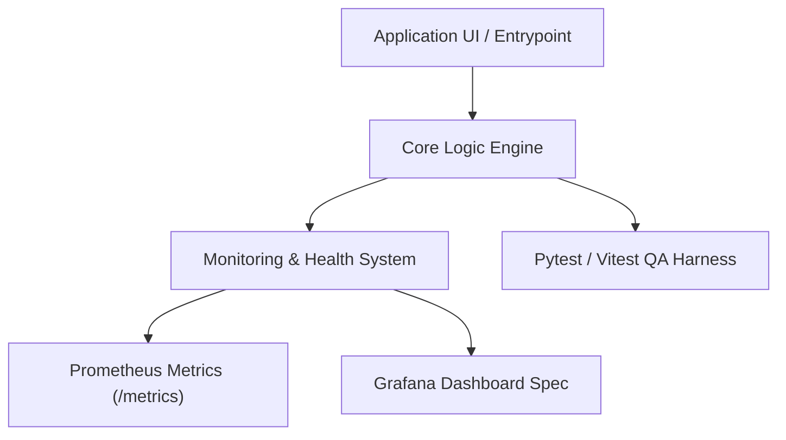

# Architecture and Design: Optimisation-de-plannings-avec-DQN

## 🏗️ Architectural Diagram

## 📦 Directory Structure
- `monitoring/`: Structured logger, Prometheus configs, Grafana dashboards, health probes
- `scripts/eval_harness.py`: Synthetic evaluation & latency score harness
- `tests/test_monitoring_and_qa.py`: QA test suite
- `.github/workflows/ci_qa_monitoring.yml`: Automated CI pipeline
